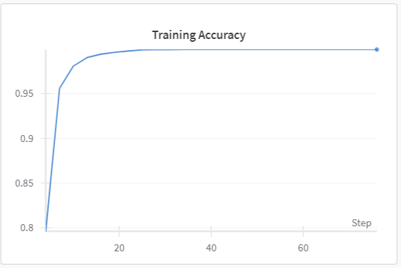
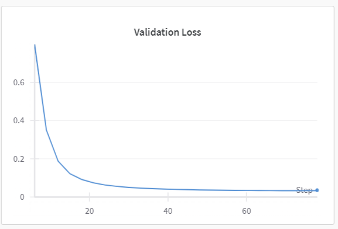
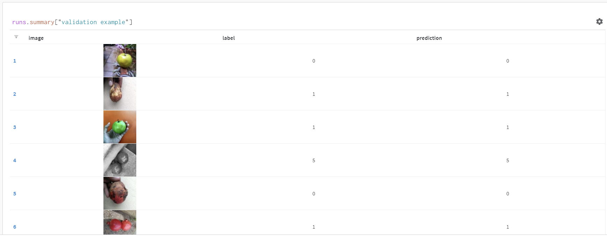
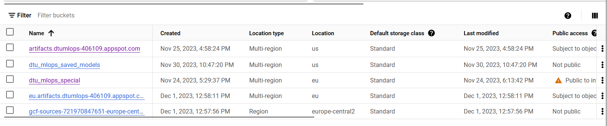
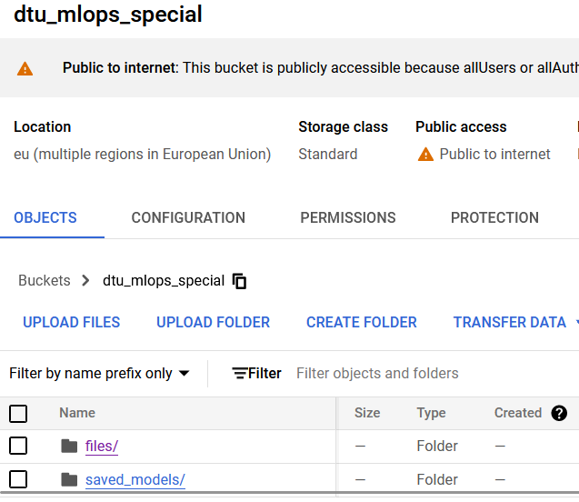
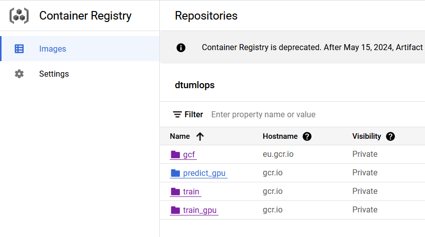
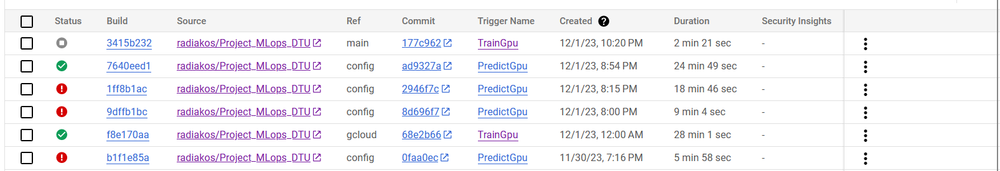

# Exam template for 02476 Machine Learning Operations

This is the report template for the exam. Please only remove the text formatted as with three dashes in front and behind
like:

```--- question 1 fill here ---```

where you instead should add your answers. Any other changes may have unwanted consequences when your report is auto
generated in the end of the course. For questions where you are asked to include images, start by adding the image to
the `figures` subfolder (please only use `.png`, `.jpg` or `.jpeg`) and then add the following code in your answer:

```markdown

```

In addition to this markdown file, we also provide the `report.py` script that provides two utility functions:

Running:

```bash
python report.py html
```

will generate an `.html` page of your report. After deadline for answering this template, we will autoscrape
everything in this `reports` folder and then use this utility to generate an `.html` page that will be your serve
as your final handin.

Running

```bash
python report.py check
```

will check your answers in this template against the constrains listed for each question e.g. is your answer too
short, too long, have you included an image when asked to.

For both functions to work it is important that you do not rename anything. The script have two dependencies that can
be installed with `pip install click markdown`.

## Overall project checklist

The checklist is *exhaustic* which means that it includes everything that you could possible do on the project in
relation the curricilum in this course. Therefore, we do not expect at all that you have checked of all boxes at the
end of the project.

### Week 1

* [x] Create a git repository
* [x] Make sure that all team members have write access to the github repository
* [x] Create a dedicated environment for you project to keep track of your packages
* [x] Create the initial file structure using cookiecutter
* [x] Fill out the `make_dataset.py` file such that it downloads whatever data you need and
* [x] Add a model file and a training script and get that running
* [x] Remember to fill out the `requirements.txt` file with whatever dependencies that you are using
* [x] Remember to comply with good coding practices (`pep8`) while doing the project
* [x] Do a bit of code typing and remember to document essential parts of your code
* [x] Setup version control for your data or part of your data
* [x] Construct one or multiple docker files for your code
* [x] Build the docker files locally and make sure they work as intended
* [x] Write one or multiple configurations files for your experiments
* [x] Used Hydra to load the configurations and manage your hyperparameters
* [x] When you have something that works somewhat, remember at some point to to some profiling and see if
      you can optimize your code
* [x] Use Weights & Biases to log training progress and other important metrics/artifacts in your code. Additionally,
      consider running a hyperparameter optimization sweep.
* [ ] Use Pytorch-lightning (if applicable) to reduce the amount of boilerplate in your code

### Week 2

* [x] Write unit tests related to the data part of your code
* [ ] Write unit tests related to model construction and or model training
* [x] Calculate the coverage.
* [ ] Get some continuous integration running on the github repository
* [x] Create a data storage in GCP Bucket for you data and preferable link this with your data version control setup
* [x] Create a trigger workflow for automatically building your docker images
* [x] Get your model training in GCP using either the Engine or Vertex AI
* [x] Create a FastAPI application that can do inference using your model
* [ ] If applicable, consider deploying the model locally using torchserve
* [x] Deploy your model in GCP using either Functions or Run as the backend

### Week 3

* [ ] Check how robust your model is towards data drifting
* [ ] Setup monitoring for the system telemetry of your deployed model
* [ ] Setup monitoring for the performance of your deployed model
* [ ] If applicable, play around with distributed data loading
* [ ] If applicable, play around with distributed model training
* [ ] Play around with quantization, compilation and pruning for you trained models to increase inference speed

### Additional

* [x] Revisit your initial project description. Did the project turn out as you wanted?
* [x] Make sure all group members have a understanding about all parts of the project
* [x] Uploaded all your code to github

## Group information

### Question 1
> **Enter the group number you signed up on <learn.inside.dtu.dk>**
>
> Answer:

--- question 1 fill here ---

### Question 2
> **Enter the study number for each member in the group**
>
> Example:
>
> *sXXXXXX, sXXXXXX, sXXXXXX*
>
> Answer:

---s222559, s213579, s223526, s222556---

### Question 3
> **What framework did you choose to work with and did it help you complete the project?**
>
> Answer length: 100-200 words.
>
> Example:
> *We used the third-party framework ... in our project. We used functionality ... and functionality ... from the*
> *package to do ... and ... in our project*.
>
> Answer:

--- We used the third-party transformers framework from huggingface specifically we used the Vision Transformer (ViT) model, which is a deep learning model and a transformer that is targeted at vision processing tasks such as image recognition, in our project. From the transformers library we utilized the classes AutoFeatureExtractor, for transformation of input images and AutoModelForImageClassification, which loads the ViT model and configures it with the relevant number of outputs for our problem. From the package to extract features from our images and package for pretrain model (ViT) for our project. The above framework helped us achieve our goal of extracting features from our data and distinguishing different types of features (e.g. fruit or its quality) from images. ---

## Coding environment

> In the following section we are interested in learning more about you local development environment.

### Question 4

> **Explain how you managed dependencies in your project? Explain the process a new team member would have to go**
> **through to get an exact copy of your environment.**
>
> Answer length: 100-200 words
>
> Example:
> *We used ... for managing our dependencies. The list of dependencies was auto-generated using ... . To get a*
> *complete copy of our development environment, one would have to run the following commands*
>
> Answer:

--- The project can be implemented through any operating system, it would be recommended to have GPU (cuda) in their computer to run it locally. We have set up a virtual environment to install all the necessary packages to run the model, using pipreqs. Although, the environments can also be achieved with Anaconda. If there's GPU availble, one should install the `requirements_gpu.txt`, otherwise, `requirements.txt`.---

### Question 5

> **We expect that you initialized your project using the cookiecutter template. Explain the overall structure of your**
> **code. Did you fill out every folder or only a subset?**
>
> Answer length: 100-200 words
>
> Example:
> *From the cookiecutter template we have filled out the ... , ... and ... folder. We have removed the ... folder*
> *because we did not use any ... in our project. We have added an ... folder that contains ... for running our*
> *experiments.*
> Answer:

--- We have also added custom folders, such as docker or conf. Indeed, we have used the cookiecutter template for the format of our project. Our data is located in the data folder (in the external subfolder) since they come for an external source (Kaggle). After being processed and cleaned the data which will be used for training validating and testing the model are relocated in the data/processed folder. We have filled most of the folders, like src (where the source code is located), notebooks (for the initials notebooks that were used to explore the data and the training), test (for unit testing), conf (for our configuration files) and docker for our containers. Ultimately, folder. git contains the workflows, and the folder .dvc contains essential configuration for data version control. ---

### Question 6

> **Did you implement any rules for code quality and format? Additionally, explain with your own words why these**
> **concepts matters in larger projects.**
>
> Answer length: 50-100 words.
>
> Answer:

--- Yes, we have used the Black code style and the cookie cutter format. By installing the cookie cutter on our virtual environment, it automatically creates the folder that you need in a Machine Learning Operations project. Everything is well defined and easy to find. Additionally, we used the black coding style, by adding the specific hook in the pre commit yaml file. Black formats all the files during committing, and it aims for consistency, generality, readability and reducing git diffs.  We also defined the line length to be limited to 88 characters per line. Lastly, we tried to document as many parts of the code as possible in an effort to make it readable, understandable and easier to maintain.  ---

## Version control

> In the following section we are interested in how version control was used in your project during development to
> corporate and increase the quality of your code.

### Question 7

> **How many tests did you implement and what are they testing in your code?**
>
> Answer length: 50-100 words.
>
> Example:
> *In total we have implemented X tests. Primarily we are testing ... and ... as these the most critical parts of our*
> *application but also ... .*
>
> Answer:

--- We have implemented 2 tests. One that tests the cleaning of our data and one that tests the creation of the dataset and data loaders that will be used throughout our model training, validation and testing. Data is one of the most important concepts for a machine learning project. Ensuring that the data cleaning and preprocessing steps are correct helps maintain data quality. Furthermore, it makes the overall machine learning pipeline more consistent and reliable.  ---

### Question 8

> **What is the total code coverage (in percentage) of your code? If you code had an code coverage of 100% (or close**
> **to), would you still trust it to be error free? Explain you reasoning.**
>
> Answer length: 100-200 words.
>
> Example:
> *The total code coverage of code is X%, which includes all our source code. We are far from 100% coverage of our **
> *code and even if we were then...*
>
> Answer:

--- The total code coverage is 82% of our code. Even if someone has 100% coverage it does not mean that the code will be error free. Code coverage is a metric that indicates the percentage of the codebase that is exercised by the tests. It is positive to have a high code coverage as close to 100% as possible but it doesn’t guarantee that all possible edge cases have been considered. In addition to having high code coverage, testing practices should include well designed tests that cover a variety of scenarios, continuous testing (in case the data has changed format for example) and lastly manual testing.  ---

### Question 9

> **Did you workflow include using branches and pull requests? If yes, explain how. If not, explain how branches and**
> **pull request can help improve version control.**
>
> Answer length: 100-200 words.
>
> Example:
> *We made use of both branches and PRs in our project. In our group, each member had an branch that they worked on in*
> *addition to the main branch. To merge code we ...*
>
> Answer:

--- We used different braches to test different stuff. Mostly each branch had its own user, so that everybody can work on things simultaneously. That quickly changed and most branches had a purpose behind them (gcloud, docker and config files etc), plus a branch were a running version of the model was kept as a failsafe. In the end we merged two branches that had all the necessary aspects we needed to include in the main branch. (mostly from gcloud branch and config). (We generally use branches so that the main part of the repository is affected while we run tests and change things in them.)---

### Question 10

> **Did you use DVC for managing data in your project? If yes, then how did it improve your project to have version**
> **control of your data. If no, explain a case where it would be beneficial to have version control of your data.**
>
> Answer length: 100-200 words.
>
> Example:
> *We did make use of DVC in the following way: ... . In the end it helped us in ... for controlling ... part of our*
> *pipeline*
>
> Answer:

---We used DVC for saving data both in google drive and google cloud. It helped us to access and store data, while working with different vms. We basically managed to store our data elsewhere other than the repository of course. Even though we used specific data that were not subject to changes (as there were specific images to be used), let's explain the functionallity and benefit of having dvc. Once you are able to push and pull the data and have it in your local machine, you can tag it as version one and then every time you make a change and push again you can in the git repository. The versioning is done when changes are made in the data and you dvc add once again. This updates the .dvc file, maintaining a record of changes. Mostly we used DVC to be able to store data on the cloud (and models) and call the data every time we had to run our model, no matter the machine we were in (VM, local etc). ---

### Question 11

> **Discuss you continues integration setup. What kind of CI are you running (unittesting, linting, etc.)? Do you test**
> **multiple operating systems, python version etc. Do you make use of caching? Feel free to insert a link to one of**
> **your github actions workflow.**
>
> Answer length: 200-300 words.
>
> Example:
> *We have organized our CI into 3 separate files: one for doing ..., one for running ... testing and one for running*
> *... . In particular for our ..., we used ... .An example of a triggered workflow can be seen here: <weblink>*
>
> Answer:

--- For our continuous integration, our group implemented the following:  

Unit testing: specifically, 2 tests, one for testing the data preprocessing/cleaning and one for testing the make_dataset script. These tests provide 82% coverage. 

Pre commit: one pre commit yaml file, which includes essential hooks (like formatting the code Black style, fixing end of files, trailing whitespace and checking the addition of large files in the project). 

GitHub actions: Every time a group member commits, the code is tested on 3 versions of Python (3.9, 3.10 and 3.11) on the latest Ubuntu and Windows operating systems. 

Triggers for GCP: We built triggers so that new docker images will be created in the cloud every time a push is made in one (any or specified) branch.

Link to our GitHub actions workflow: https://github.com/radiakos/Project_MLops_DTU/blob/main/.github/workflows/tests.yml  ---

## Running code and tracking experiments

> In the following section we are interested in learning more about the experimental setup for running your code and
> especially the reproducibility of your experiments.

### Question 12

> **How did you configure experiments? Did you make use of config files? Explain with coding examples of how you would**
> **run a experiment.**
>
> Answer length: 50-100 words.
>
> Example:
> *We used a simple argparser, that worked in the following way: python my_script.py --lr 1e-3 --batch_size 25*
>
> Answer:

---We exploited hydra in order to manage our hyperparameters, the various paths and other important parameters of our code. We created different config files for the different experiments: train, test, predict, using the hydra. However, in order to use Fastapi, due to conflict with hydra, we had to handle in a manual way the directories(that are actively change in each vm).
Regarding the training, the training and only, we mounted hydra with exp.yaml files, that allows to keep different sets of config files.---

### Question 13

> **Reproducibility of experiments are important. Related to the last question, how did you secure that no information**
> **is lost when running experiments and that your experiments are reproducible?**
>
> Answer length: 100-200 words.
>
> Example:
> *We made use of config files. Whenever an experiment is run the following happens: ... . To reproduce an experiment*
> *one would have to do ...*
>
> Answer:

---We made use of configuration files in order to secure that no information is lost when running different experiments. For our experiments we used a variety of hyperparameters and to make sure that no information is lost, we primarily logged these hyperparameters on wandb, alongside the results of our model training, validation and testing. Additionally, we used the hydra configuration tool, throughout our codebase, to load the hyperparameters from the configuration files and to keep track of the outputs. This way, we can always track the experiments and ensure their reproducibility.--

### Question 14

> **Upload 1 to 3 screenshots that show the experiments that you have done in W&B (or another experiment tracking**
> **service of your choice). This may include loss graphs, logged images, hyperparameter sweeps etc. You can take**
> **inspiration from [this figure](figures/wandb.png). Explain what metrics you are tracking and why they are**
> **important.**
>
> Answer length: 200-300 words + 1 to 3 screenshots.
>
> Example:
> *As seen in the first image when have tracked ... and ... which both inform us about ... in our experiments.*
> *As seen in the second image we are also tracking ... and ...*
>
> Answer:

---Wandb allowed us to save not only the hyperparameters of the models, but also to monitor the progress of ourexperiments. More specifically, we logged the losses of the model in each epoch, the training, validation and test accuracy and the test loss. Additionally, the hyperparameters such as training, validation and test batch size, number of epochs, learning rate and number of the trainers.






---

### Question 15

> **Docker is an important tool for creating containerized applications. Explain how you used docker in your**
> **experiments? Include how you would run your docker images and include a link to one of your docker files.**
>
> Answer length: 100-200 words.
>
> Example:
> *For our project we developed several images: one for training, inference and deployment. For example to run the*
> *training docker image: `docker run trainer:latest lr=1e-3 batch_size=64`. Link to docker file: <weblink>*
>
> Answer:

--- At first, we used Docker locally. We have created two dockerfiles to build the images for training/testing and predicting, with: (1) a base image that works with GPU (cuda), (2) the corresponding requirements installed, (3) the source and data folders copied, (4) the WandB and GCP/dvc credentials needed, (5) dvc set up and pulling of the data, and (6) the respective py scripts as entrypoints. We have tested these images by running several containers locally (on the computers with available GPU). 

As a next step, we move to the cloud. To build the images, we have used Cloud Build service: we have created two triggers that, by means of two cloudbuild yaml files with a list of steps, build and push the images, which can then be pulled. To run the containers, we train models on Vertex AI training, based on the available successful images on Cloud Build. 

Training docker image: `docker run trainer: lr=1e-3 batch_size=6`. Link to docker file: <https://console.cloud.google.com/gcr/images/dtumlops-406109/GLOBAL/train_gpu@sha256:607158a41f8025fc01a57f506eedbd53e594d1ee94495ed7440ed4a6fa623b9a/details> ---

### Question 16

> **When running into bugs while trying to run your experiments, how did you perform debugging? Additionally, did you**
> **try to profile your code or do you think it is already perfect?**
>
> Answer length: 100-200 words.
>
> Example:
> *Debugging method was dependent on group member. Some just used ... and others used ... . We did a single profiling*
> *run of our main code at some point that showed ...*
>
> Answer:

--- We mostly used the debbuger mode in VSCode. All of us made use of it and local tests to see how the code performs. ---

## Working in the cloud

> In the following section we would like to know more about your experience when developing in the cloud.

### Question 17

> **List all the GCP services that you made use of in your project and shortly explain what each service does?**
>
> Answer length: 50-200 words.
>
> Example:
> *We used the following two services: Engine and Bucket. Engine is used for... and Bucket is used for...*
>
> Answer:

--- We used `Cloud Storage` to store our data and models in buckets (pushed and pulled with DVC). Triggers to be used when pushing from a branch of our git repository and used config files to then automatically (or manually). Container Registry where our docker images from our triggers and from training our model on VertexAI were storred. VertexAI to train our model. Cloud Run where we tried to deploy our model (and functions), but unsuccessfully. (+billing)---

### Question 18

> **The backbone of GCP is the Compute engine. Explained how you made use of this service and what type of VMs**
> **you used?**
>
> Answer length: 100-200 words.
>
> Example:
> *We used the compute engine to run our ... . We used instances with the following hardware: ... and we started the*
> *using a custom container: ...*
>
> Answer:

--- So, we did not create our own virtual machine with its own specifications . We did however use Vertex AI. This basically creates a virtual machine and uses our own specifications and docker image, to train the model for example, and then closes the vm after the process is finished. We used instances with the following hardware:  `machineType`: n1-standard-8 for CPU run in `europe-central2` region succesfully. We tried all the gpus in all the regions within EU, but all outputed the quotas error and failed to run... ---

### Question 19

> **Insert 1-2 images of your GCP bucket, such that we can see what data you have stored in it.**
> **You can take inspiration from [this figure](figures/bucket.png).**
>
> Answer:

--- 
---

### Question 20

> **Upload one image of your GCP container registry, such that we can see the different images that you have stored.**
> **You can take inspiration from [this figure](figures/registry.png).**
>
> Answer:

---  ---

### Question 21

> **Upload one image of your GCP cloud build history, so we can see the history of the images that have been build in**
> **your project. You can take inspiration from [this figure](figures/build.png).**
>
> Answer:

---   ---

### Question 22

> **Did you manage to deploy your model, either in locally or cloud? If not, describe why. If yes, describe how and**
> **preferably how you invoke your deployed service?**
>
> Answer length: 100-200 words.
>
> Example:
> *For deployment we wrapped our model into application using ... . We first tried locally serving the model, which*
> *worked. Afterwards we deployed it in the cloud, using ... . To invoke the service an user would call*
> *`curl -X POST -F "file=@file.json"<weburl>`*
>
> Answer:

--- We managed to deploy the model locally with Fastapi. Fastapi gives us the ability to upload any image and predict its class, using the specific model from cloud bucket that we selected before launching the application. The deployment with Fastapi required not to use hydra, due to conflict to args parsing. For that reason, we needed to create a different py file, only for our fastapi application. Additionally, having everything set up, models in cloud bucket, bucket for our images (where the user can upload images), the required dockerfile for the prediction, as well as the respective configuration, in which the user can select both the model and the image. However, we didn’t manage to deploy the model in cloud. When doing the cloud run, we got a port error. I.e. that we could not connect to the predefined port (as said before). We tried different ones, but with no success. ---

### Question 23

> **Did you manage to implement monitoring of your deployed model? If yes, explain how it works. If not, explain how**
> **monitoring would help the longevity of your application.**
>
> Answer length: 100-200 words.
>
> Example:
> *We did not manage to implement monitoring. We would like to have monitoring implemented such that over time we could*
> *measure ... and ... that would inform us about this ... behaviour of our application.*
>
> Answer:

--- Unfortunately, we did not implement monitoring for our deployed model. Monitoring plays a crucial role in ensuring the longevity, stability, and optimal performance of an application throughout its lifecycle. Some ways in which monitoring contributes to the longevity of a Machine Learning Operations project are making the project available and reliable, tracking the utilization of resource like CPU, GPU and memory, and monitoring potential data drifting that would degrade the model's accuracy. A future improvement for our project would be to use evidently to monitor potential data drifting that would cause a degrade in our model's accuracy and efficiency. Furthermore, another future improvement would be to set up an alert system for our deployed project, to monitor the metrics that are important for our model.  ---

### Question 24

> **How many credits did you end up using during the project and what service was most expensive?**
>
> Answer length: 25-100 words.
>
> Example:
> *Group member 1 used ..., Group member 2 used ..., in total ... credits was spend during development. The service*
> *costing the most was ... due to ...*
>
> Answer:

--- s222556 used 100 credits from the free trial on his personal account---

## Overall discussion of project

> In the following section we would like you to think about the general structure of your project.

### Question 25

> **Include a figure that describes the overall architecture of your system and what services that you make use of.**
> **You can take inspiration from [this figure](figures/overview.png). Additionally in your own words, explain the**
> **overall steps in figure.**
>
> Answer length: 200-400 words
>
> Example:
>
> *The starting point of the diagram is our local setup, where we integrated ... and ... and ... into our code.*
> *Whenever we commit code and puch to github, it auto triggers ... and ... . From there the diagram shows ...*
>
> Answer:

--- question 25 fill here ---

### Question 26

> **Discuss the overall struggles of the project. Where did you spend most time and what did you do to overcome these**
> **challenges?**
>
> Answer length: 200-400 words.
>
> Example:
> *The biggest challenges in the project was using ... tool to do ... . The reason for this was ...*
>
> Answer:

--- For starters the model was an issue. The code had to be changed some times during the whole project to match the ideas we had on how it would work. Next up, DVC. This didn't work at all for us when we used the google drive space to store our data. While if someone dvc pushed the data could usually pull it, the rest could not. This was fixed when we used the bucket from the GCP and created a google group to allow permissions for all our users and stored our credentials in a json to use when creating a docker image on the cloud. The docker image .yaml file was also challenging, as there was no explanations online or many examples that could help us. Through trying over and over we figured it out and made it work. Training the model on a gpu was also impossible in GCP, as it always provided an error of not enough quotas to train our model there and you can't edit the quotas in the free trial. We managed to run on HPC and locally on a coputer with gpu and in GCP using CPU. FastAPI and how to use an image as an input to predict the class of the image, because we wanted to do both that and run a random image from the test files if none was inputted, also we couldn't find a way to use hydra and FastAPI simultaneously. Lastly Cloud Run was not very successful. It kept giving us an error about the port we used (8080), but we tried a few more and it also didn't work and we were mostly out of time at that point. ---

### Question 27

> **State the individual contributions of each team member. This is required information from DTU, because we need to**
> **make sure all members contributed actively to the project**
>
> Answer length: 50-200 words.
>
> Example:
> *Student sXXXXXX was in charge of developing of setting up the initial cookie cutter project and developing of the*
> *docker containers for training our applications.*
> *Student sXXXXXX was in charge of training our models in the cloud and deploying them afterwards.*
> *All members contributed to code by...*
>
> Answer:

* Student s222556 was in charge of setting up dvc, Google Cloud Platform (Cloud Build, Vertex AI, Cloud Run, Cloud Storage, Cloud Functions), developing FastAPI, and code typing.
* Student s222559 was in charge of developing and implementing the train and predict models, FastAPI, dockerfiles, debugging, profiling, and wandb.
* Student s213579 was in charge of dockerfiles, code typing, running GCP services.
* Student ss223526 was in charge of implementing the data preprocessing, train of the model, wandb, pre-commit file and developed tests for unit testing the data preprocessing and make dataset.
